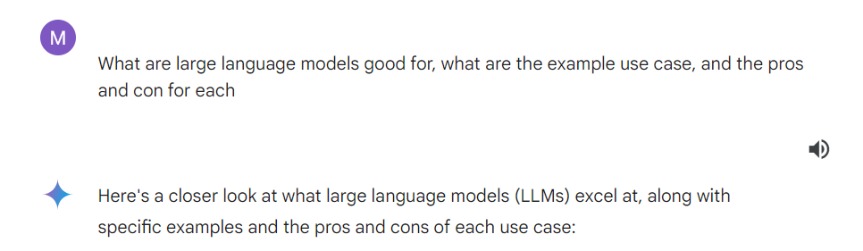
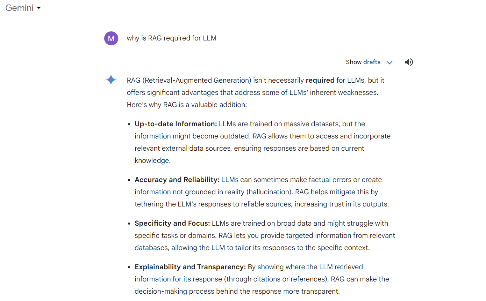
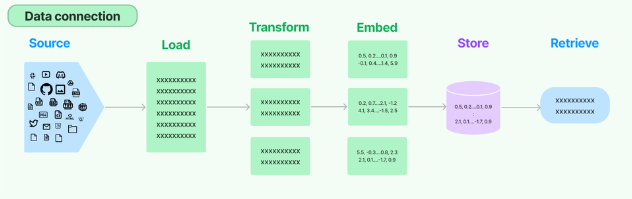

# LLM Learning

# Agenda
1. Parameter efficient Finetuning with LORA [15 mins]

2. Overview of LLM (review) [10mins]
    - RAG
3. Notebook Scripts walkthough [15 mins]
    a. hands on - RAG prompt [20 mins]

4. Streamlit Scripts walkthrough [10 mins]
    b. hands on - adding a select components [20 mins]

5. Hackathon (next week) [20mins]
    - team forming
    - topics/discussion

# 2. Overview of LLM (review)

1. **Text Generation**

    Example: An LLM can create different creative text formats, like poems, code, scripts, musical pieces, emails, letters, etc.
    Pros: Breaks through writer's block, generates ideas, saves time on repetitive tasks.
    Cons: May lack originality, factual accuracy needs verification, may not capture the desired tone or style perfectly.

2. **Machine Translation**

    Example: An LLM can translate text from one language to another, breaking down language barriers.
    Pros: Enables communication across languages, facilitates global collaboration, helps access information in different languages.
    Cons: Nuances and cultural references may be lost, translations may not be grammatically perfect, formality levels might not be conveyed accurately.

3. **Question Answering**

    Example: An LLM can answer your questions in an informative way, like a giant search engine with the ability to understand and respond to complex queries.
    Pros: Provides quick access to information, saves time from researching, personalizes responses based on context.
    Cons: Answers might not be exhaustive or definitive, accuracy depends on the quality of the training data, may not be able to answer open ended, challenging, or subjective questions.

4. **Chatbots and Virtual Assistants**

    Example: An LLM can power chatbots that can answer customer queries, schedule appointments, or provide technical support.
    Pros: Offers 24/7 customer service, automates repetitive tasks, personalizes interactions with users.
    Cons: May not understand complex requests, might struggle with sarcasm or humor, can't handle situations requiring empathy or critical thinking.

Overall, LLMs offer a compelling mix of benefits, but it's important to be aware of their limitations and use them appropriately.  Remember, they are still under development, and researchers are working on addressing  their shortcomings.

# RAG

## What is RAG?
RAG is a technique for augmenting LLM knowledge with additional data.

LLMs can reason about wide-ranging topics, but their knowledge is limited to the public data up to a specific point in time that they were trained on. If you want to build AI applications that can reason about private data or data introduced after a model’s cutoff date, you need to augment the knowledge of the model with the specific information it needs. The process of bringing the appropriate information and inserting it into the model prompt is known as Retrieval Augmented Generation (RAG).

## Overview

## Componets

- **Retrieve**: Given a user input, relevant splits are retrieved from storage using a Retriever.
- **Generate**: A ChatModel / LLM produces an answer using a prompt that includes the question and the retrieved data

# 3. Notebook Scripts walkthough [10 mins]
    - walkthourgh
    - challange - complete the RAG-calling part

# 4. Streamlit Scripts walkthrough [10 mins]
    - walkthrough
    - hands on - adding a select components [20 mins]

# 5. Hackathon (next week) [20mins]
    **Via Microsoft Team white board**
    Come up with any idea that utilize LLM to enhance day 2 day insurance work
    - Could be claims, underwritting
    - Or generation of marketing message of special context?
    - Or maybe just explanation/QnA on insurance terms/code

    Team forming
        max of 2 person per team

    #
    topics/discussion

References
1. https://wow.groq.com/
2. https://blog.langchain.dev/building-chat-langchain-2/